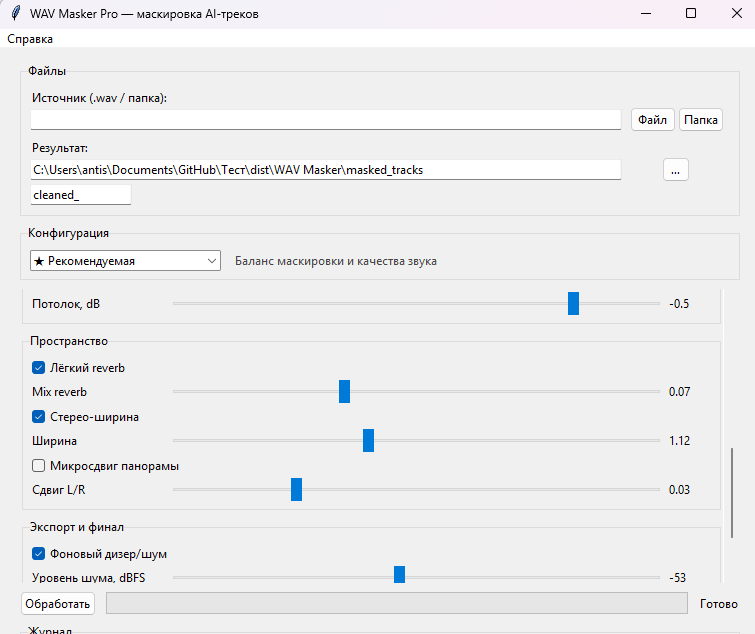

# WAV Masker Pro

Программа для пакетной обработки WAV-файлов: пресеты, графический интерфейс, русский и английский языки, версия для Windows без установки Python.



**Автор:** Slayer · Сделано в Ноябрьске — там всегда зима

## Скачать и запустить (для пользователей)

1. Откройте **[Releases](https://github.com/SlayerSS/wav-masker/releases)**.
2. Скачайте **`WAV-Masker-Pro-1.0.0-win64.zip`**.
3. Распакуйте архив.
4. Запустите **`WAV Masker.exe`**.

Python и установка не нужны.

### ffmpeg (только для этапа MP3)

Если нужен проход WAV → MP3 → WAV:

1. Скачайте [ffmpeg для Windows](https://www.gyan.dev/ffmpeg/builds/) (`ffmpeg-release-essentials.zip`).
2. Скопируйте **`ffmpeg.exe`** из папки `bin` в ту же папку, где лежит **`WAV Masker.exe`**.

Либо установите ffmpeg в системный PATH. Без ffmpeg остальные функции работают.

## Возможности

- Пакетная обработка файлов и папок
- Пресеты: рекомендуемая, лёгкая, агрессивная, максимальная, своя
- Интерфейс на русском и английском (меню **Язык**)
- Подсказки к каждой настройке (ⓘ)
- Обрезка тишины, темп, pitch, ресэмпл
- EQ, фильтры, компрессия, reverb, стерео
- Опционально: WAV → MP3 → WAV

## Запуск из исходников (разработка)

```powershell
run.bat
```

Или: `python -m venv .venv` → `pip install -r requirements.txt` → `python app_gui.py`

Сборка EXE: **`build.bat`**

## Форки

С указанием оригинала: https://github.com/SlayerSS/wav-masker — см. [FORKING.md](FORKING.md).

## Лицензия

MIT — [LICENSE](LICENSE).
